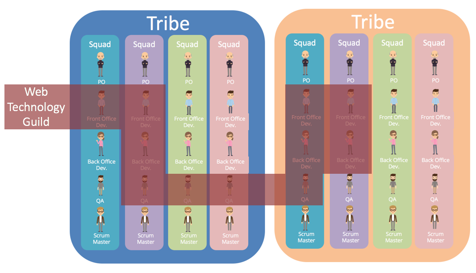

# Modelo Spotify

Não usamos tudo on the book pois temos nossa cultura com missão e valores a like BR (no bom sentido)! Mas, gostamos muito de como o Spotify resolveu vários problemas para que o time se tornassem autônomos e eficazes - modelo sem atitude não funciona!

Por isso, usamos algumas coisas do Spotify como inspiração para gerar a nossa organização de times e buscamos acima de tudo incentivar atitudes que geram resultados incríveis.

## Squad

São pequenos grupos multi-disciplinares. A diferença entre um time tradicional e um squad é justamente a característica de serem multi-disciplinar e incorporar a cultura DevOps. Cada squad é responsável por um produto ou um fragmento do produto, dependendo da complexidade.

Devido a estas características, um Squad possui a velocidade e eficiência de uma startup.

Ser multi-disciplinar significa que cada squad pode ser comporta por:
- Um ou mais desenvolvedores FrontEnd
- Um ou mais desenvolvedores BackEnd
- Um ou mais mobile developer
- Pode haver um Ops dedicado
- Pode haver um QA dedicado
- Pode haver PO dedicado
- Pode haver um gerente de engenharia dedicado

## Tribes

São um agrupamento de Squads catalogados com o objetivo de atacar questões que se relacionam entre si ou no aspecto de produto ou no aspecto técnico ou em ambos.

## Guild

As Guilds são agrupamentos de afinidade técnica, cross-organizacional. Com o objetivo de reunir profissionais para compartilhar idéia, conhecimento, código, ferramentas, boas práticas.

Exemplos de Guild:

- Guild de Arduino
- Guild de Python
- Guild de FrontEnd
- Guild de Agile
- Guild de BigData

As Guild permitem que qualquer pessoa da empresa participe sobre os temas de interesse.

A Guild pode ter sua agenda organizada pelo profissional mais experiente naquele assunto ou através da escolha de um Guild coordinator que será responsável pelas agendas.

## Chapter

Semelhante a uma Guild mas com o objetivo de criar uma linha de gerenciamento. Por tanto tem o comportamento de um time especializado mas que fica inserido. Não usamos muito o conceito de chapter.
